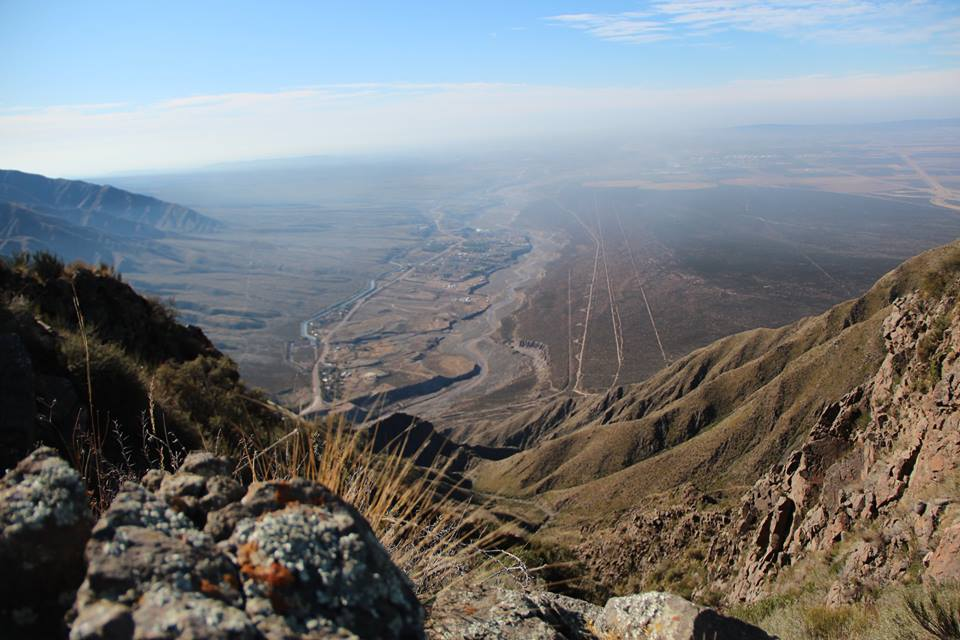

# 👋 Hi, I’m Qk Carricondo.
## :space_invader: Data Alchemist

- 👀 I’m interested in modeling human behaviour using artificial intelligence.
- :musical_score: You can find my TEDx talk in: [Moviemiento en Clave de Sol](https://www.youtube.com/watch?v=kbLH--fVzXY)
- 🌱 _Always learning, always moving._

## 	:mechanical_arm: My technology stack

<code></code>
<code></code>
<code></code>
<code></code>
<code></code>
<code></code>
<code></code>
<code></code>
<code></code>
<code></code>
<code></code>
<code></code>
<code></code>

## :thought_balloon: You can find me

 
 
 

  
   

   

 Based in Mendoza. 

<!---
Qk527/Qk527 is a ✨ special ✨ repository because its `README.md` (this file) appears on your GitHub profile.
You can click the Preview link to take a look at your changes.
--->
